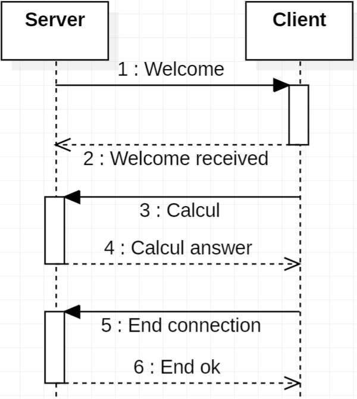

# Protocol objectives
#### Client/Server calculator service 
# Overall behavior 
#### using TPC protocol
#### fix server ip and port
#### client search for the server first
#### the connection is closed by the client when needed
# Messages
## Syntax
### Coté client
#### WELCOME RECEIVED
#### CALCUL left operator right
#### END CONNECTION
### Coté Server
#### WELCOME
#### LISTOPERATION [+,*]
#### RESULT value
#### END CONNECTION OK
#### ERROR NUM_error MSG_error (1 = operation not supported / 2 = syntax error)

# Specific elements
#### the supported operation are addition and multiplication for all servers, servers can implement more operations.

# Example dialog
#### WELCOME
#### WELCOME RECEIVED
#### LISTOPERATION [+,*,/]
#### CALCUL 4 + 5
#### RESULT 9
#### CALCUL 4 - 5
#### ERROR 1 operation not supported
#### CALCUL a + b
#### ERROR 2 syntax error (required "left value" "operator" "right value")
#### END CONNECTION
#### END OK
